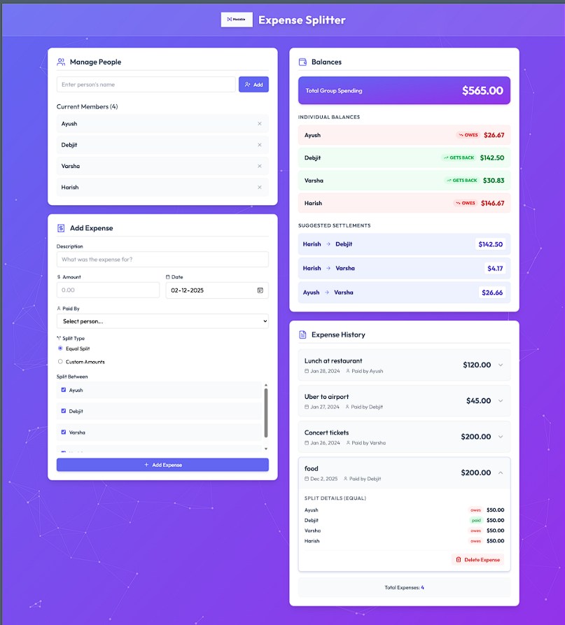
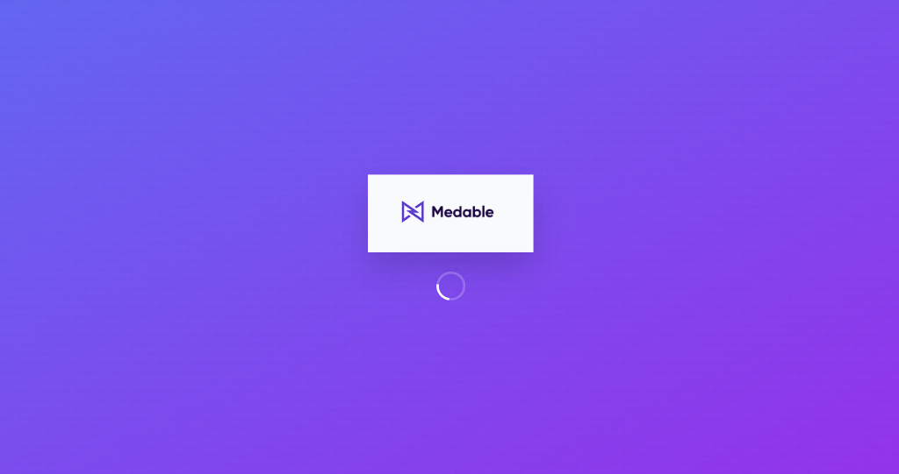
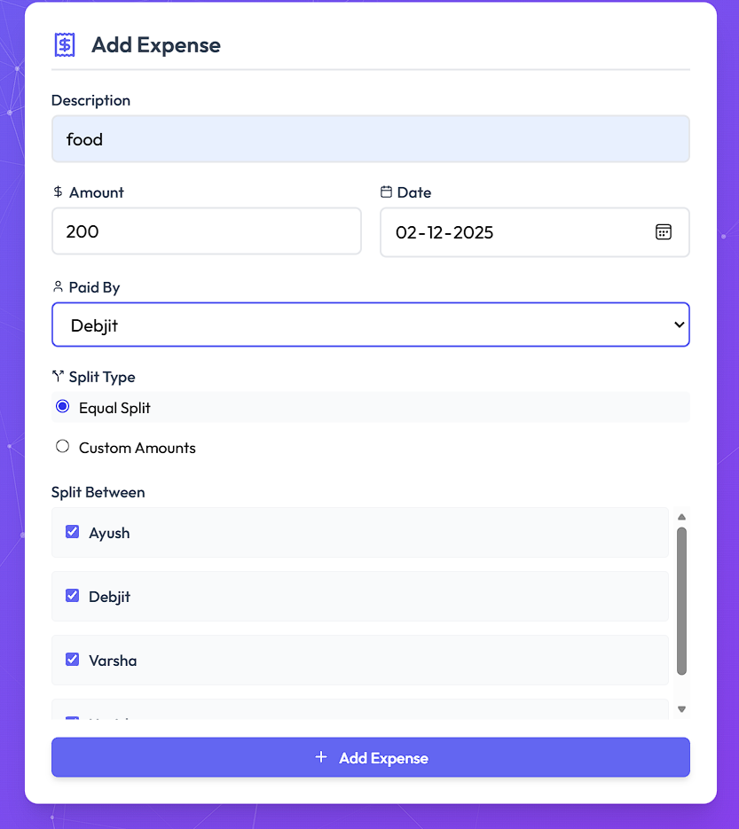
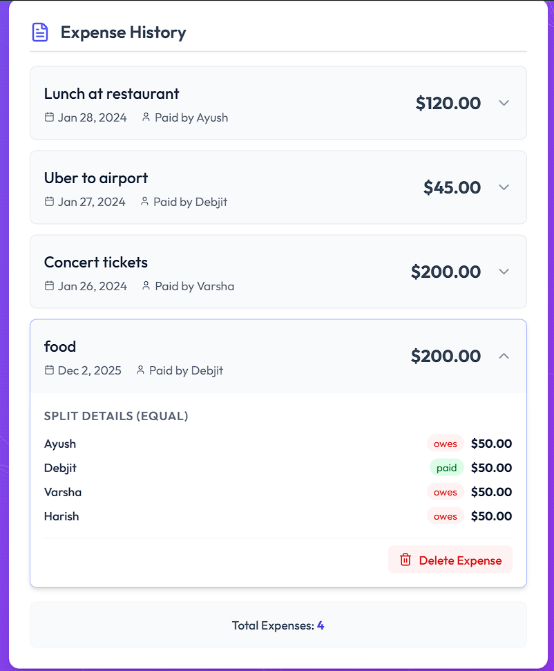
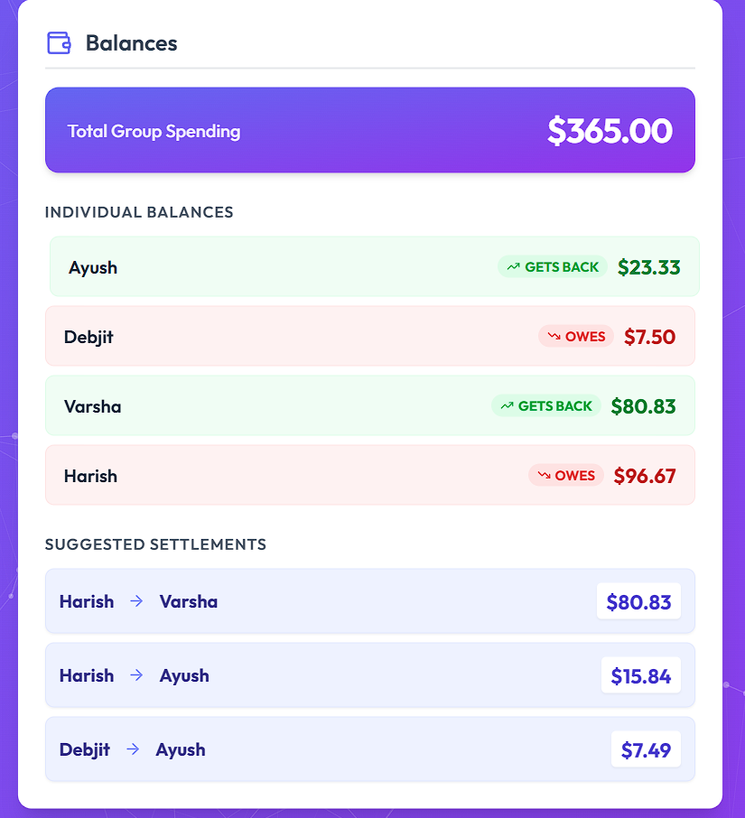

# 💰 Expense Splitter — Smart Shared Expense Management

<div align="center">

**A modern, intuitive way to split bills and settle debts with friends**

[](https://reactjs.org/)
[](https://vitejs.dev/)
[](https://tailwindcss.com/)
[](https://www.typescriptlang.org/)
[](LICENSE)

</div>

---

## 📖 Table of Contents

- [Overview](#-overview)
- [Screenshots](#️-screenshots)
- [Real-Life Use Cases](#-real-life-use-cases)
- [Features](#-features)
- [Algorithm](#-algorithm)
- [Tech Stack](#-tech-stack)
- [Setup & Installation](#-setup--installation)
- [Folder Structure](#-folder-structure)
- [Future Roadmap](#-future-roadmap)
- [Contributing](#-contributing)
- [License](#-license)

---

## 🌟 Overview

**Expense Splitter** is a sleek, user-friendly application designed to solve the common headache of sharing expenses. Whether it's a group trip, a shared apartment, or a night out, this app simplifies the math and ensures everyone pays their fair share.

### The Problem

Sharing costs with friends often leads to:
- ❌ Confusing mental math
- ❌ "Who owes who?" arguments
- ❌ Multiple small, inefficient transactions
- ❌ Forgotten debts over time

### Our Solution

Expense Splitter provides:
- ✅ **Automated Calculations** - Instantly know who owes what
- ✅ **Debt Simplification** - Minimizes the number of transactions needed to settle up
- ✅ **Visual Clarity** - Clean, modern UI with real-time balance updates
- ✅ **Flexible Splitting** - Support for both equal and custom split amounts
- ✅ **Detailed History** - Transparent breakdown of every expense

---

## 🖼️ Screenshots

### Dashboard Overview

*A comprehensive view of people, expenses, balances, and history in one place.*

### Splash Screen

*Branded splash screen with the Medable logo for a polished entry experience.*

### Add Expense

*Intuitive form to add expenses with support for equal or custom splits.*

### Expense History

*Expandable history items showing detailed breakdowns of who paid and who owes.*

### Smart Balances

*Real-time balance tracking and optimized settlement suggestions.*

---

## 💡 Real-Life Use Cases

### ✈️ Scenario 1: Group Vacation

**User Journey:**
1. **Alice, Bob, Charlie, and Diana** go on a weekend trip.
2. Alice pays $200 for the rental car.
3. Bob pays $120 for dinner.
4. Charlie pays $50 for snacks.
5. The app tracks every expense and calculates the net balance for each person.
6. At the end, the app suggests the most efficient way to settle debts (e.g., "Diana pays Alice $92.50").

**Value Delivered:**
- No spreadsheets required
- Fair distribution of costs
- Stress-free settlement

---

### 🏠 Scenario 2: Shared Apartment

**User Journey:**
1. **Roommates** share rent, utilities, and groceries.
2. One person pays the electricity bill, another buys cleaning supplies.
3. They log expenses throughout the month.
4. The app maintains a running tally of who is ahead or behind.
5. Balances can be settled monthly or carried over.

**Value Delivered:**
- Transparent household finances
- Reduces friction between roommates
- Real-time visibility of shared costs

---

## ✨ Features

| Feature | Description |
|---------|-------------|
| 👥 **People Management** | Add and remove group members dynamically |
| 💸 **Expense Tracking** | Log expenses with descriptions, dates, and payers |
| 🧮 **Flexible Splitting** | Choose between **Equal Split** or **Custom Amounts** |
| ⚖️ **Smart Settlements** | Algorithmically minimizes the number of transactions |
| 📜 **Detailed History** | Expandable list items showing granular split details |
| 🎨 **Modern UI** | Glassmorphism effects, particles background, and smooth animations |
| 📱 **Responsive Design** | Works seamlessly on desktop and tablet sizes |

---

## 🧠 Algorithm

The application uses a **Greedy Algorithm** to simplify debts. Here's how it works:

1.  **Calculate Net Balance**: For each person, calculate `Total Paid - Total Share`.
2.  **Separate Debtors and Creditors**:
    *   **Debtors**: Negative balance (they owe money).
    *   **Creditors**: Positive balance (they are owed money).
3.  **Match and Settle**:
    *   Take the debtor who owes the most and the creditor who is owed the most.
    *   The debtor pays the creditor the minimum of `|Debt|` or `Credit`.
    *   Update balances and repeat until all debts are settled.

**Result**: This ensures that the group settles all debts with the **minimum possible number of transactions**, avoiding circular payments (e.g., A pays B, B pays C, C pays A).

---

## 🛠️ Tech Stack

| Technology | Purpose |
|------------|---------|
| **React** | Component-based UI library |
| **TypeScript** | Type safety and better developer experience |
| **Vite** | Blazing fast build tool and dev server |
| **Tailwind CSS** | Utility-first styling for rapid UI development |
| **Lucide React** | Beautiful, consistent icon set |
| **tsparticles** | Interactive particle background effects |

---

## 🚀 Setup & Installation

### Prerequisites

- **Node.js** 18+ ([Download](https://nodejs.org/))
- **npm** or **yarn**

### Installation Steps

```bash
# 1. Clone the repository
git clone https://github.com/your-username/expense-splitter-challenge.git
cd expense-splitter-challenge

# 2. Install dependencies
npm install

# 3. Start development server
npm run dev
# App running on http://localhost:5173
```

---

## 📂 Folder Structure

```
expense-splitter-challenge/
│
├── public/                   # Static assets (logo, favicon)
├── screenshots/              # Images for README
├── src/
│   ├── assets/               # Project assets
│   ├── components/           # React components
│   │   ├── BalanceView.tsx   # Displays balances & settlements
│   │   ├── ExpenseForm.tsx   # Form to add new expenses
│   │   ├── ExpenseList.tsx   # List of past expenses
│   │   ├── PeopleManager.tsx # Manage group members
│   │   ├── ParticlesBackground.tsx # Background effect
│   │   └── SplashScreen.tsx  # Intro animation
│   │
│   ├── context/              # Global state management
│   │   └── ExpenseContext.tsx
│   │
│   ├── utils/                # Helper functions
│   │   └── calculations.ts   # Debt simplification logic
│   │
│   ├── App.tsx               # Main application component
│   ├── main.tsx              # Entry point
│   ├── types.ts              # TypeScript interfaces
│   └── index.css             # Global styles & Tailwind imports
│
├── index.html                # HTML template
├── package.json              # Dependencies and scripts
├── tailwind.config.js        # Tailwind configuration
├── tsconfig.json             # TypeScript configuration
└── vite.config.ts            # Vite configuration
```

---

## 🛣️ Future Roadmap

- [ ] **Persistence** - Save data to LocalStorage or a backend database
- [ ] **Multi-Currency Support** - Handle expenses in different currencies
- [ ] **User Accounts** - Cloud sync and collaboration
- [ ] **Export to PDF/CSV** - Download expense reports
- [ ] **Dark Mode** - Native dark theme support

---

## 🤝 Contributing

Contributions are welcome! Please follow these steps:

1. **Fork** the repository
2. **Create** a feature branch (`git checkout -b feature/AmazingFeature`)
3. **Commit** your changes (`git commit -m 'Add some AmazingFeature'`)
4. **Push** to the branch (`git push origin feature/AmazingFeature`)
5. **Open** a Pull Request

---

## 📝 License

This project is licensed under the **MIT License**.

---

<div align="center">

**⭐ Star this repo if you find it helpful!**

Built with ❤️ using React & Tailwind CSS

</div>
